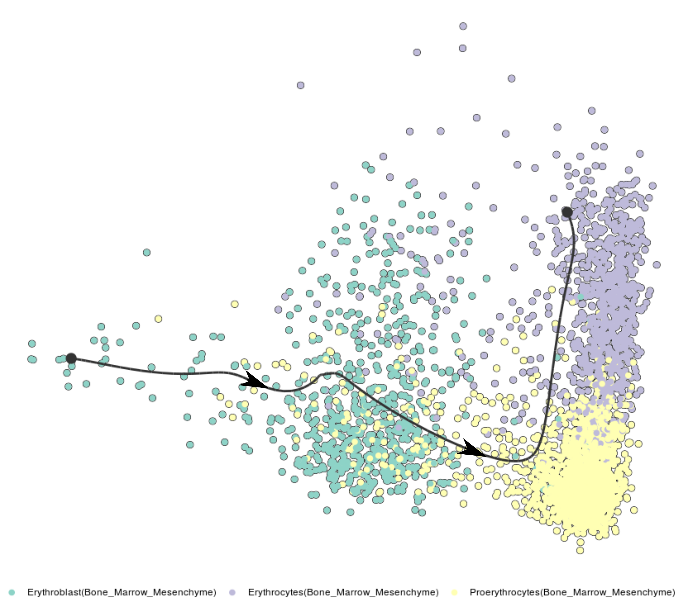

# Mouse Bone Marrow Mesenchyme to Erythrocyte Differentiation
This directory contains the following files related to the Mouse Bone Marrow Mesenchyme to Erythrocyte Differentiation dataset.

- **gene_list.mat:** list of 3025 genes in the dataset.
- **X_BMTF.mat:** Pre-processed version of log-transformed count data corresponding to the genes in `gene_list.mat` from 3105 pseudotime-ordered cells from an Embeddr-inferred trajectory as shown below:

For inferring the regulatory network using transcription factors only as regulators, we use AnimalTFDB3 to identify 149 transcription factors in this dataset.
Their indices are listed in the `regix` array in `X_BMTF.mat`.
The sources to cite for this expression dataset and the AnimalTFDB3 database are:
- [Han et al. 2018](https://doi.org/10.1016/j.cell.2018.02.001), [expression dataset](https://figshare.com/s/865e694ad06d5857db4b)
- [Hu et al. 2019](https://doi.org/10.1093/nar/gky822), [AnimalTFDB3 database](http://bioinfo.life.hust.edu.cn/static/AnimalTFDB3/download/Mus_musculus_TF)
