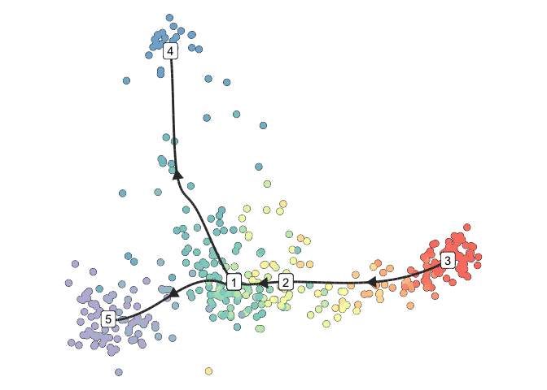

This is an [R Markdown](http://rmarkdown.rstudio.com) Notebook. When you
execute code within the notebook, the results appear beneath the code.

Run dynverse on example dataset as described in the dynverse quick start
guide
    (<https://dynverse.org/users/2-quick_start/>):

``` r
library(dyno)
```

    ## Loading required package: dynfeature

    ## Loading required package: dynguidelines

    ## Loading required package: dynmethods

    ## Loading required package: dynplot

    ## Loading required package: dynwrap

``` r
library(tidyverse)
```

    ## ── Attaching packages ──────────────────────────────────────────────────────────────────────────────────── tidyverse 1.3.0 ──

    ## ✓ ggplot2 3.3.2     ✓ purrr   0.3.4
    ## ✓ tibble  3.0.3     ✓ dplyr   1.0.2
    ## ✓ tidyr   1.1.2     ✓ stringr 1.4.0
    ## ✓ readr   1.3.1     ✓ forcats 0.5.0

    ## ── Conflicts ─────────────────────────────────────────────────────────────────────────────────────── tidyverse_conflicts() ──
    ## x dplyr::filter() masks stats::filter()
    ## x dplyr::lag()    masks stats::lag()

``` r
data("fibroblast_reprogramming_treutlein")

dataset <- wrap_expression(
  counts = fibroblast_reprogramming_treutlein$counts,
  expression = fibroblast_reprogramming_treutlein$expression
)

model <- infer_trajectory(dataset, 'slingshot')
```

    ## Loading required namespace: hdf5r

``` r
model <- model %>% add_dimred(dyndimred::dimred_mds, expression_source = dataset$expression)
plot_dimred(
    model, 
    expression_source = dataset$expression, 
    label_milestones = TRUE
)
```

    ## Coloring by milestone

    ## Using milestone_percentages from trajectory

<!-- -->
Slingshot infers this dataset as having a branching trajectory. The two
main subtrajectories traverse through the milestones 3-\>2-\>1-\>4 and
3-\>2-\>1-\>5, in that order, with the root milestone being 3. We
explicitly assign the root milestone as ‘3’, followed by a pseudotime
assignment.

``` r
model <- add_root(model,root_milestone_id = '3')
model <- add_pseudotime(model)
```

Now, we assign branch groupings corresponding to the trajectory progress
between milestones and extract cells corresponding to the individual
subtrajectories in cell\_T1 and
cells\_T2

``` r
branch_groupings = group_onto_trajectory_edges(model, group_template = "{from}->{to}")
T1 = branch_groupings[which(branch_groupings %in% c("1->4","2->1","3->2"))]
cells_T1 = names(T1)
T2 = branch_groupings[which(branch_groupings %in% c("1->5","2->1","3->2"))]
cells_T2 = names(T2)
```

We extract array pseudotime, order the expression data by pseudotime
values of the cells, and extract branch information for the two
subtrajectories in a matrix names branches. If the i-th cell is in
branch b, then the element branches\[i,b\] = 1, otherwise this element
is set to zero.

``` r
pseudotime = model$pseudotime
od = order(pseudotime)
pseudotime = pseudotime[od]
expr = dataset$counts
expr = expr[od,]
expr = as.matrix(expr)
branches = as.data.frame(matrix(0L,nrow = length(pseudotime), ncol = 1))
branches[cells_T1,1] = 1
branches[cells_T2,2] = 1
```

Finally, we save pseudotime, branches and expression values in tab
separated files.

``` r
write.table(pseudotime, file = "pseudotime.txt")
write.table(branches, file = "branches.txt")
write.table(expr,file = "expressions.txt")
```
